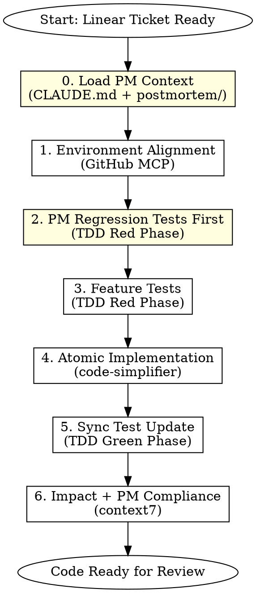
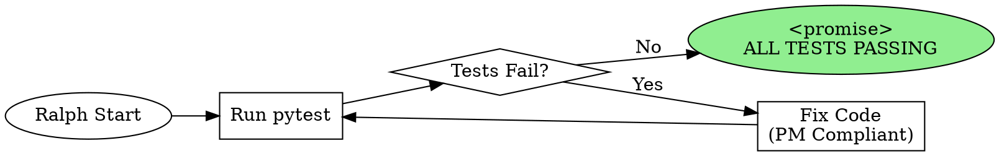

# Blueprint Develop - Test-Driven Strategy Implementation

## Overview

Execute strategy implementation with TDD discipline and **Postmortem regression prevention**. Every code change must align with backtest interfaces, pass PM compliance checks, and have synchronized test coverage.

## Core Principle

```
./postmortem/ = 深度病历库 (Deep Case History)
./CLAUDE.md   = 高频手术准则 (High-Frequency Operating Rules)

Rule: 每写一行代码前，先查 CLAUDE.md；每改一个模块前，先查相关 postmortem
```

## When to Use

- Implementing new trading strategy logic from Linear tickets
- Modifying existing strategy code in `strategies/`
- User mentions "开发", "implement", or "code the strategy"
- Any code change that affects trading logic

**Do NOT use when:**
- Planning strategy (use `blueprint-plan` instead)
- Pure backtest runs without code changes
- Documentation or config changes only

## Prerequisites

Before invoking this skill, verify:
- [ ] Linear ticket exists for the work (from `blueprint-plan`)
- [ ] Backtest framework is in place (`backtest/` directory)
- [ ] Test file location confirmed (`tests/backtest_unit.py`)
- [ ] **PM mitigations from ticket identified** (from `blueprint-plan` Phase 0)

## Workflow



## 🔄 Ralph Loop Integration (Optional Iterative Mode)

**When to Activate:** Complex implementations requiring multiple test-fix cycles.

Ralph Loop enables **iterative self-correction**: Claude repeatedly sees its own work and improves until all tests pass.

### Triggering Ralph Loop

Invoke when:
- Multiple test failures expected during implementation
- Complex logic requiring iterative refinement
- User requests "迭代开发" or "ralph mode"

```
Skill: ralph-loop:ralph-loop

Prompt Template:
"Implement [strategy component] following TDD.
PM Compliance Checklist: [from Phase 0]
Current test failures: [list from pytest]
Target: ALL tests in tests/backtest_unit.py and tests/pm_regression/ passing.
Output <promise>ALL TESTS PASSING</promise> when complete."

Options:
--max-iterations 15
--completion-promise "ALL TESTS PASSING"
```

### Ralph Loop Development Cycle



### Ralph Loop Exit Conditions

| Condition | Action |
|-----------|--------|
| All tests pass | Output `<promise>ALL TESTS PASSING</promise>`, exit loop |
| Max iterations reached | Exit with summary, human decision needed |
| PM violation detected | **STOP LOOP**, fix compliance first |
| Blocked by external issue | Exit with `<promise>BLOCKED: [reason]</promise>` |

### PM Compliance During Ralph Loop

**CRITICAL:** Each iteration must maintain PM compliance:

```python
# Ralph Loop PM Check (every iteration)
1. Before each code change:
   - Reference PM Compliance Checklist
   - Check CLAUDE.md directives

2. After each test run:
   - Verify no PM regression test failures
   - If PM test fails: PRIORITY FIX before feature tests
```

### When NOT to Use Ralph Loop

- Simple single-function implementations
- Clear, non-iterative changes
- When human guidance needed mid-implementation

## Phase 0: Load PM Context (MANDATORY)

**Goal:** Internalize all relevant warnings before writing any code.

### Step 0.1: Read CLAUDE.md

```bash
# ALWAYS read first
cat ./CLAUDE.md
```

Extract all directives and warnings relevant to the current task.

### Step 0.2: Read Relevant Postmortems

From the Linear ticket's PM Immune Screening section, identify related PMs:

```bash
# Read each PM mentioned in ticket
cat ./postmortem/PM-XXX-*.md
```

### Step 0.3: Create PM Compliance Checklist

Generate a checklist to verify during implementation:

```markdown
## 📋 PM Compliance Checklist for This Implementation

### From CLAUDE.md (High-Frequency Rules)
- [ ] [Directive 1]
- [ ] [Directive 2]
- [ ] [Warning to avoid]

### From Postmortems (Specific to Ticket)
- [ ] PM-001: [Specific mitigation]
- [ ] PM-003: [Specific mitigation]

### Code Patterns to AVOID (from PMs)
```python
# DON'T: [anti-pattern from PM]
# DO: [correct pattern]
```
```

**Output:** PM Compliance Checklist visible throughout implementation.

## Phase 1: Environment Alignment

**Goal:** Ensure new strategy aligns with existing backtest interfaces.

### Step 1.1: Execute Implementation Plan

```
Use Skill tool: superpowers:executing-plans
Purpose: Execute the implementation plan from Linear ticket
Context: Strategy requirements, PM mitigations, test requirements
```

### Checklist

Use GitHub MCP to inspect:

```
1. mcp__github__get_file_contents: backtest/ directory structure
2. Identify interface contracts:
   - Data input format (OHLCV? Tick? Custom?)
   - Required method signatures (run(), evaluate(), etc.)
   - Output format (trades[], metrics{})
```

### Interface Alignment Matrix

| Interface | Check | Action if Mismatch |
|-----------|-------|-------------------|
| **Data Format** | Input schema matches historical data | Adapt strategy to use existing format |
| **Method Signature** | Strategy implements required methods | Add missing methods |
| **Output Format** | Results compatible with metrics pipeline | Convert output format |
| **Dependencies** | No version conflicts | Pin versions in requirements |

**Output:** Interface alignment report or list of adaptations needed.

## Phase 2: PM Regression Tests First (CRITICAL)

**Goal:** Write tests that specifically prevent PM-documented failures from recurring.

### PM Regression Test Template

```python
# tests/pm_regression/test_pm_XXX.py

class TestPM001Regression:
    """Regression tests for PM-001: Order Duplication

    Root Cause: Missing idempotency key
    Mitigation: All orders must include client_order_id
    """

    def test_order_has_idempotency_key(self):
        """Every order placement must include client_order_id"""
        order = strategy.create_order(...)
        assert order.client_order_id is not None
        assert len(order.client_order_id) >= 16

    def test_duplicate_order_rejected(self):
        """Attempting duplicate order raises DuplicateOrderError"""
        order_id = "test-order-123"
        strategy.place_order(client_order_id=order_id)
        with pytest.raises(DuplicateOrderError):
            strategy.place_order(client_order_id=order_id)


class TestPM003Regression:
    """Regression tests for PM-003: Liquidity Trap

    Root Cause: No exit strategy for illiquid markets
    Mitigation: Check liquidity before entry, implement timeout exit
    """

    def test_liquidity_check_before_entry(self):
        """Strategy refuses entry when liquidity below threshold"""
        illiquid_market = MockMarket(depth=100)  # Below threshold
        signal = strategy.evaluate(illiquid_market)
        assert signal.action == "NO_ENTRY"
        assert "insufficient_liquidity" in signal.reason

    def test_timeout_exit_triggered(self):
        """Position exits after max_hold_time if no liquidity"""
        # ... test implementation
```

### Required PM Test Categories

| PM Category | Test Coverage |
|-------------|--------------|
| **API Issues** | Rate limit handling, timeout recovery, retry logic |
| **Order Issues** | Idempotency, duplication, rejection handling |
| **Market Issues** | Liquidity checks, spread validation, halt detection |
| **Data Issues** | Missing data handling, stale data detection |

**BLOCKING:** All PM regression tests must PASS before proceeding to feature tests.

## Phase 3: Feature Tests (TDD Red Phase)

**Goal:** Define expected feature behavior before implementation.

### Test File Location

```
tests/backtest_unit.py  # Primary location
tests/strategies/       # Strategy-specific tests (if exists)
tests/pm_regression/    # PM regression tests (NEW)
```

### Test Template

```python
# tests/backtest_unit.py

class Test[StrategyName]:
    """Tests for [Strategy Name] - Ticket: [LINEAR-XXX]"""

    def test_entry_signal(self):
        """Strategy generates entry signal under expected conditions"""
        # Arrange: Set up market state
        # Act: Call strategy logic
        # Assert: Verify signal generated
        pass

    def test_exit_signal(self):
        """Strategy generates exit signal for position management"""
        pass

    def test_position_limits(self):
        """Strategy respects position limits from risk parameters"""
        pass

    def test_edge_case_no_data(self):
        """Strategy handles missing data gracefully"""
        pass
```

### Test Categories Required

| Category | Coverage | Priority |
|----------|----------|----------|
| **PM Regression** | All PM mitigations from ticket | P0 (BLOCKING) |
| **Entry Logic** | Signal generation, threshold triggers | P0 |
| **Exit Logic** | Stop loss, take profit, time-based | P0 |
| **Risk Limits** | Position caps, exposure limits | P0 |
| **Edge Cases** | Missing data, API errors, market halts | P1 |
| **Performance** | Execution time, memory usage | P2 |

**Action:** Write failing tests BEFORE any implementation code.

## Phase 4: Atomic Implementation

**Goal:** Keep strategy logic minimal, PM-compliant, and focused.

### Pre-Implementation PM Check

Before writing ANY code, verify against PM Compliance Checklist:

```
For each function/method:
1. Does this touch any PM-flagged area?
   - If YES: Reference the PM mitigation pattern
   - If NO: Proceed with standard implementation
2. Am I violating any CLAUDE.md directive?
3. Am I introducing a pattern documented as "DON'T" in a PM?
```

### Step 4.1: Frontend Design (if frontend-related)

If the implementation involves frontend components, UI, or web interfaces:

```
Use Skill tool: frontend-design:frontend-design
Purpose: Create high-quality frontend interfaces
Focus: Modern UI/UX, component design, user experience
```

### Step 4.2: Invoke code-simplifier Skill

```
Use Skill tool: code-simplifier:code-simplifier
Purpose: Review implementation for simplicity before commit
```

### Atomic Implementation Rules

| Rule | Guideline | Anti-pattern |
|------|-----------|--------------|
| **Single File < 200 LOC** | Split into modules if exceeding | 500+ line strategy file |
| **One Responsibility** | Each function does one thing | `calculate_and_place_and_log()` |
| **No Premature Optimization** | Simple first, optimize with profiler | Custom data structures without need |
| **Explicit Dependencies** | Import at top, no dynamic imports | `__import__()` or lazy loading |
| **PM Pattern Compliance** | Use patterns from PMs, not anti-patterns | Repeating documented mistakes |

### File Structure

```
strategies/
├── base.py           # Abstract base class
├── [strategy_name]/
│   ├── __init__.py
│   ├── signals.py    # Signal generation (< 100 LOC)
│   ├── execution.py  # Order management (< 100 LOC)
│   └── risk.py       # Risk checks (< 50 LOC)
```

**Output:** Implementation that passes tests from Phase 2 AND Phase 3.

## Phase 5: Synchronized Test Update

**Goal:** Maintain 1:1 correspondence between code and tests.

### Sync Protocol

For EVERY code change:

```
Code Change                    → Required Test Update
─────────────────────────────────────────────────────
New function added             → New test case added
Function signature changed     → Update test calls
Threshold/parameter changed    → Update test assertions
Logic branch added             → Add test for branch
PM mitigation added            → Add PM regression test
```

### Verification Command

```bash
# Run ALL tests including PM regression
pytest tests/ -v --tb=short

# PM regression tests specifically (must all pass)
pytest tests/pm_regression/ -v

# Coverage check (should increase or stay same, never decrease)
pytest --cov=strategies --cov-report=term-missing
```

### Step 5.2: Systematic Debugging (if tests fail)

If any tests fail:

```
Use Skill tool: superpowers:systematic-debugging
Purpose: Systematic approach to debugging test failures
Focus: Identify root cause, fix while maintaining PM compliance
```

**Output:** All tests passing, coverage maintained.

## Phase 6: Impact + PM Compliance Analysis

**Goal:** Verify changes don't break existing strategies AND don't violate PM mitigations.

### Step 6.1: Gather Context for Impact Analysis

```
Use Skill tool: context7:context7
Purpose: Gather comprehensive context about code changes and their impact
Focus: Related code patterns, dependencies, existing strategies, PM mitigations
```

### Step 6.2: PM Compliance Final Check

```markdown
## PM Compliance Verification

### CLAUDE.md Directives
| Directive | Compliant? | Evidence |
|-----------|------------|----------|
| [Directive 1] | ✅ | Line XX in file.py |
| [Directive 2] | ✅ | Test case test_xxx |

### Postmortem Mitigations
| PM | Mitigation | Implemented? | Test Coverage |
|----|------------|--------------|---------------|
| PM-001 | Idempotency key | ✅ | test_pm_001.py |
| PM-003 | Liquidity check | ✅ | test_pm_003.py |

### Anti-Patterns Avoided
- [x] No hardcoded API keys (PM-002)
- [x] No unbounded retries (PM-004)
```

### Cross-Strategy Impact Matrix

```
Use Grep to search for:
1. Shared base class usage
2. Common utility function calls
3. Config key references
4. Event/signal handlers
```

**Output:** Impact report + PM Compliance Verification.

## Phase 7: Finalize Development Branch

**Goal:** Commit changes and prepare branch for review.

### Step 7.1: Commit Changes

```
Use Skill tool: commit-commands:commit
Purpose: Create standardized commit message for strategy implementation
Message should reference: Linear ticket, PM mitigations implemented
```

### Step 7.2: Finish Development Branch

```
Use Skill tool: superpowers:finishing-a-development-branch
Purpose: Integrate work, ensure branch is ready for review
Verify:
- All tests passing
- PM compliance verified
- Code follows conventions
- Ready for blueprint-review
```

**Output:** Branch committed and ready for review.

## Quick Reference

| Phase | Tool/Skill | Key Action |
|-------|-----------|------------|
| 0. PM Load | `Read` | Load CLAUDE.md + relevant postmortems |
| 1. Execute | `superpowers:executing-plans` | Execute implementation plan |
| 1. Align | `mcp__github__get_file_contents` | Check backtest/ interfaces |
| 2. PM Test | Manual | Write PM regression tests FIRST |
| 3. Test | `superpowers:test-driven-development` | Write feature tests |
| 4. Frontend | `frontend-design:frontend-design` | If frontend-related (optional) |
| 4. Implement | `code-simplifier:code-simplifier` | PM-compliant, atomic, < 200 LOC |
| 5. Sync | `pytest` via Bash | Run ALL tests after each change |
| 5b. Debug | `superpowers:systematic-debugging` | If tests fail |
| 6. Impact | `context7:context7` + `Grep` | Gather context + Impact + PM compliance check |
| 7. Finish | `commit-commands:commit` + `superpowers:finishing-a-development-branch` | Commit and prepare for review |
| 🔄 Ralph | `ralph-loop:ralph-loop` | Iterative test-fix cycle (optional) |

## Common Mistakes

| Mistake | Prevention |
|---------|------------|
| **Skipping PM context load** | Phase 0 is MANDATORY before any code |
| **No PM regression tests** | Write PM tests before feature tests |
| Implementing before tests | Always write test first, run to see it fail |
| Large monolithic files | Split at 200 LOC, use module structure |
| Changing shared code without impact check | Run Phase 6 before any shared code change |
| **Repeating PM anti-patterns** | Reference PM "DON'T" patterns before coding |
| Test-code desync | Use checklist: code change → test change |

## Exit Criteria

Before marking Linear ticket as "Done":

- [ ] **PM Compliance Checklist: All items verified**
- [ ] **PM regression tests: All passing**
- [ ] All feature tests in `tests/backtest_unit.py` pass
- [ ] Test coverage ≥ 80% for new code
- [ ] No files exceed 200 LOC
- [ ] Impact analysis completed
- [ ] No regression in existing strategy tests

## Example Invocation

### Standard Mode
```
User: "Implement the mean-reversion strategy from ticket LIN-123"

Claude:
0. [PM Load] Reading CLAUDE.md... 5 relevant directives found
   Reading PM-003 (liquidity trap)... Mitigation: exit_timeout required
   PM Compliance Checklist created with 7 items

1. [Align] Checking backtest/ interfaces... Data format: OHLCV, 1-min candles

2. [PM Test] Writing PM regression tests...
   - test_liquidity_check_before_entry ❌ (not implemented yet)
   - test_exit_timeout_triggers ❌ (not implemented yet)

3. [Test] Writing feature tests...
   - test_entry_signal ❌
   - test_exit_signal ❌

4. [Implement] Creating strategies/mean_reversion/...
   - PM-compliant: liquidity check added to signals.py:45
   - PM-compliant: exit_timeout in execution.py:78

5. [Sync] All tests passing:
   - PM regression: 4/4 ✅
   - Feature tests: 12/12 ✅
   - Coverage: 87%

6. [Impact] No impact on existing strategies
   PM Compliance: All 7 checklist items verified ✅

Output: PR ready for review, PM compliant
```

### 🔄 Ralph Loop Mode (Iterative)
```
User: "迭代开发 order execution module，用 ralph loop"

Claude:
0-3. [Standard Phases Complete]
   PM Compliance Checklist: 5 items
   Tests written: 8 failing

🔄 [Ralph Loop Activated]
   Invoking: /ralph-loop "Implement order execution for mean-reversion.
   PM Checklist: [5 items]
   Failing tests: 8
   Output <promise>ALL TESTS PASSING</promise> when done."
   --max-iterations 10
   --completion-promise "ALL TESTS PASSING"

   Iteration 1: 8/8 tests failing → Fixed signal generation
   Iteration 2: 5/8 tests failing → Fixed order placement
   Iteration 3: 3/8 tests failing → Fixed PM-001 idempotency
   Iteration 4: 1/8 tests failing → Fixed edge case
   Iteration 5: 0/8 tests failing

   <promise>ALL TESTS PASSING</promise>

🔄 [Ralph Loop Complete]
   Iterations: 5/10
   Tests: 8/8 ✅
   PM Compliance: Maintained throughout ✅

6. [Impact] Proceeding with impact analysis...

Output: Complex implementation completed via iterative refinement
```
