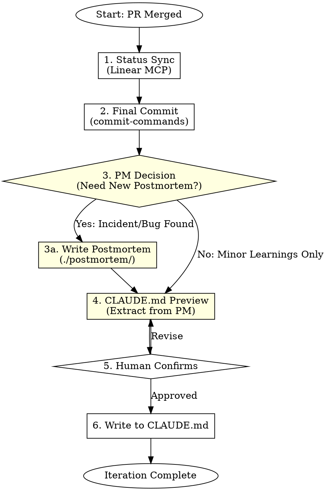
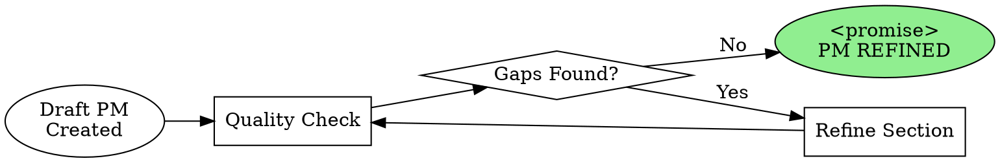

# Blueprint Optimize - Dual-Layer Memory Crystallization

## Overview

Complete the iteration cycle by syncing status, committing properly, and permanently capturing hard-won lessons in the **dual-layer memory system**:

- `./postmortem/` = Deep case history (detailed analysis)
- `./CLAUDE.md` = High-frequency operating rules (concise directives)

## Core Principle

```
./postmortem/ = 深度病历库 (Deep Case History)
                → 完整的事故分析、root cause、时间线、详细修复
                → 无行数限制，越详细越好

./CLAUDE.md   = 高频手术准则 (High-Frequency Operating Rules)
                → 只有指令和警告，无解释
                → 严格 ≤ 100 行

Rule: 先写病历 (postmortem)，再提炼准则 (CLAUDE.md)
```

## When to Use

- PR has been merged (after `blueprint-review`)
- Ready to close out the iteration
- User mentions "上线", "merge complete", "close ticket", or "记录经验"
- **After any incident, bug, or significant learning**

**Do NOT use when:**
- PR still under review (use `blueprint-review`)
- Still implementing (use `blueprint-develop`)

## Prerequisites

Before invoking this skill, verify:
- [ ] PR merged to main branch
- [ ] All tests passing on main
- [ ] Linear ticket exists and is linked to PR

## Workflow



## Phase 1: Status Sync

**Goal:** Mark Linear ticket as Done and ensure all links are in place.

### Update Linear Ticket

```
Tool: mcp__plugin_linear_linear__update_issue

Parameters:
- id: [ticket_id]
- state: "Done"
```

### Verification Checklist

| Item | Action |
|------|--------|
| Ticket state → Done | `update_issue` with state |
| PR link attached | Verify via `get_issue` |
| Sub-tickets closed | Update each child ticket |
| Labels updated | Add "shipped" or equivalent |

### Comment Summary

Add closing comment to ticket:

```
Tool: mcp__plugin_linear_linear__create_comment

Body:
✅ Strategy shipped to main
- PR: [PR link]
- Backtest Sharpe: X.XX
- PM: [PM-XXX if created, or "None"]
- CLAUDE.md: [Updated/No change]
```

**Output:** Linear ticket marked Done with closing comment.

## Phase 2: Final Commit (if needed)

**Goal:** Ensure any final changes follow commit conventions.

### Invoke commit-commands Skill

```
Use Skill tool: commit-commands:commit
Purpose: Generate standardized commit message
```

### Commit Message Format

```
<type>(<scope>): <subject>

<body>

<footer>

Co-Authored-By: Claude Code <noreply@anthropic.com>
```

**Output:** Clean commit following project conventions.

## Phase 3: Postmortem Decision & Creation

**Goal:** Determine if a new postmortem is needed, and create if yes.

### Decision Matrix

| Condition | Create PM? | PM Severity |
|-----------|-----------|-------------|
| Bug caused incorrect trades | YES | CRITICAL |
| API issue discovered | YES | HIGH |
| Performance degradation found | YES | MEDIUM |
| Edge case hit in backtest | YES | MEDIUM |
| Code worked but pattern was suboptimal | NO | - |
| Simple refactor, no issues | NO | - |

### Postmortem Template

Create file: `./postmortem/PM-[NNN]-[brief-description].md`

```markdown
# PM-[NNN]: [Incident Title]

## Metadata
- **Date:** [YYYY-MM-DD]
- **Severity:** CRITICAL | HIGH | MEDIUM | LOW
- **Strategy:** [Strategy Name]
- **Linear Ticket:** [LIN-XXX]
- **Author:** [Name/Claude Code]

## Summary
[One paragraph describing what happened]

## Timeline
- [HH:MM] [Event 1]
- [HH:MM] [Event 2]
- [HH:MM] [Detection/Discovery]
- [HH:MM] [Resolution]

## Root Cause Analysis

### What Happened
[Detailed technical explanation]

### Why It Happened
[5 Whys analysis or similar]

### Contributing Factors
- [Factor 1]
- [Factor 2]

## Impact
- **Financial:** [Estimated loss/gain, if any]
- **Operational:** [Service disruption, if any]
- **Data:** [Data corruption/loss, if any]

## Resolution
[What was done to fix the immediate issue]

## Mitigations Implemented

### Code Changes
```python
# BEFORE (anti-pattern)
[code snippet]

# AFTER (correct pattern)
[code snippet]
```

### Tests Added
- `tests/pm_regression/test_pm_[NNN].py`

### Configuration Changes
- [Config change 1]

## Lessons Learned

### What Went Well
- [Item 1]

### What Went Wrong
- [Item 1]

### Action Items
- [ ] [Action 1] - Owner: [Name]
- [ ] [Action 2] - Owner: [Name]

## Keywords
`[keyword1]` `[keyword2]` `[keyword3]`

## Related
- Previous: PM-[XXX] (if related)
- See also: [Link to docs/code]
```

### PM Naming Convention

```
PM-001-order-duplication.md
PM-002-api-timeout-cascade.md
PM-003-liquidity-trap-election.md
```

**Output:** Postmortem file created (or decision to skip documented).

### 🔄 Ralph Loop: Iterative PM Refinement (Optional)

**When to Activate:** Complex incidents requiring thorough root cause analysis.

For significant incidents, use Ralph Loop to iteratively refine the postmortem quality:

```
Skill: ralph-loop:ralph-loop

Prompt Template:
"Refine Postmortem PM-[NNN] for quality.
Incident: [brief description]

Quality Checklist:
- [ ] Root cause identified (not just symptoms)
- [ ] 5 Whys analysis complete
- [ ] Code snippets include before/after
- [ ] Action items are specific and assigned
- [ ] Keywords comprehensive for future search

Current gaps: [list]
Output <promise>PM REFINED</promise> when all checklist items complete."

Options:
--max-iterations 5
--completion-promise "PM REFINED"
```

### Ralph Loop PM Refinement Cycle



### PM Quality Checklist for Ralph Loop

| Section | Quality Criteria |
|---------|------------------|
| **Root Cause** | Specific, technical, not "human error" |
| **5 Whys** | Chain leads to systemic fix, not blame |
| **Code Snippets** | Actual code, not pseudocode |
| **Timeline** | Timestamped, includes detection method |
| **Action Items** | SMART: Specific, Measurable, Assigned |
| **Keywords** | ≥5 relevant search terms |

### When to Use Ralph Loop for PM

| Situation | Use Ralph Loop? |
|-----------|----------------|
| CRITICAL severity incident | ✅ Yes - thorough analysis needed |
| First incident of its type | ✅ Yes - establish good template |
| Similar to existing PM | ❌ No - reference existing, add delta |
| Simple config error | ❌ No - straightforward PM sufficient |

## Phase 4: CLAUDE.md Preview Generation

**Goal:** Extract high-frequency rules from postmortem (or learnings) for CLAUDE.md.

### Extraction Rules

| From Postmortem | To CLAUDE.md |
|-----------------|--------------|
| Root Cause | ⚠️ WARNING (one line) |
| Code Fix Pattern | 📋 DIRECTIVE (one line) |
| Parameter Value | 🔢 PARAMETER (one line) |
| Timeline Detail | ❌ OMIT |
| 5 Whys Analysis | ❌ OMIT |
| Impact Assessment | ❌ OMIT |

### CRITICAL: Human Review Required

**DO NOT write directly to CLAUDE.md. Generate preview first.**

### Preview Template

```markdown
---
## 📝 Proposed Addition to CLAUDE.md

### Source: PM-[NNN] - [Title] ([Date])

#### ⚠️ WARNINGS
- [Extracted from Root Cause - ONE LINE, specific values]

#### 📋 DIRECTIVES
- [Extracted from Resolution - ONE LINE, actionable]

#### 🔢 PARAMETERS
- [Parameter]: [Value] ([brief reason])

---

**Estimated CLAUDE.md impact:** +X lines (current: Y, after: Z)
**Total after update:** Z/100 lines

⚡ Please review the above. Reply "确认" to write, or provide edits.
```

### Quality Checklist for Preview

| Check | Example Pass | Example Fail |
|-------|--------------|--------------|
| Specific values | "429 after 50 req/min" | "API has rate limits" |
| Actionable | "Use decimal.Decimal" | "Be careful with floats" |
| One line max | "Check market.active before orders" | [Multi-line explanation] |
| No prose | Just the rule | "Because we found that..." |

**Output:** Markdown preview displayed to user, awaiting confirmation.

## Phase 5: Human Confirmation

**Goal:** Ensure human approves before modifying project memory.

### Wait for User Response

| Response | Action |
|----------|--------|
| "确认" / "confirm" / "yes" | Proceed to Phase 6 |
| Edits provided | Regenerate preview with changes |
| "取消" / "cancel" | Skip CLAUDE.md update |

### Revision Handling

If user provides edits:
1. Incorporate feedback
2. Regenerate preview
3. Show updated preview
4. Wait for confirmation again

**Output:** User confirmation received.

## Phase 6: Write to CLAUDE.md

**Goal:** Append high-frequency rules to project memory file.

### Pre-Write Line Count Check

```bash
wc -l CLAUDE.md
# MUST check before writing
```

### 100 Line Limit Enforcement

If exceeding 100 lines after addition:

```markdown
⚠️ CLAUDE.md will exceed 100 lines after this addition.

Current: 92 lines
Adding: 15 lines
Total: 107 lines (7 over limit)

### Pruning Candidates (Oldest First)

1. **Lines 5-12:** Mean-Reversion v1 (2023-06-01) - 8 lines
   - Superseded by PM-015? [Y/N]

2. **Lines 13-20:** Early API Learnings (2023-07-15) - 8 lines
   - Still relevant? [Y/N]

### Options:
1. Prune selected entries
2. Condense new content further
3. Move old entries to postmortem archive
4. Proceed anyway (NOT RECOMMENDED)

Which entries should be pruned?
```

### Write Rules

| Rule | Implementation |
|------|---------------|
| **Append only** | Add at end, never delete without approval |
| **100 line HARD limit** | Must prune if exceeding |
| **Preserve structure** | Match existing formatting |
| **Date stamp** | Always include date for each entry |
| **PM Reference** | Always link to source postmortem |

### Write Action

```
Tool: Edit or Write (append mode)
File: CLAUDE.md
Content: [Approved preview content]
```

### Post-Write Verification

```bash
# Verify line count
wc -l CLAUDE.md
# MUST be ≤ 100
```

**Output:** CLAUDE.md updated, line count confirmed.

## Quick Reference

| Phase | Tool/Skill | Key Action |
|-------|-----------|------------|
| 1. Sync | `mcp__plugin_linear_linear__update_issue` | Mark ticket Done |
| 2. Commit | `commit-commands:commit` | Standardized commit |
| 3. PM | `Write` to `./postmortem/` | Create if incident found |
| 3b. 🔄 Ralph | `ralph-loop:ralph-loop` | Iterative PM refinement (optional) |
| 4. Preview | Manual generation | Extract rules from PM |
| 5. Confirm | `AskUserQuestion` or wait | Human approval required |
| 6. Write | `Edit` to `CLAUDE.md` | Append, enforce 100 line limit |

## Dual-Layer Memory Architecture

```
┌─────────────────────────────────────────────────────────────┐
│                    INCIDENT OCCURS                           │
└─────────────────────────────────────────────────────────────┘
                            │
                            ▼
┌─────────────────────────────────────────────────────────────┐
│  ./postmortem/PM-XXX.md (深度病历库)                          │
│  ─────────────────────────────────────────────────────────  │
│  • Full timeline                                            │
│  • Root cause analysis (5 Whys)                             │
│  • Code snippets (before/after)                             │
│  • Impact assessment                                        │
│  • Action items                                             │
│  • NO LINE LIMIT - be thorough                              │
└─────────────────────────────────────────────────────────────┘
                            │
                            │ EXTRACT
                            ▼
┌─────────────────────────────────────────────────────────────┐
│  ./CLAUDE.md (高频手术准则)                                   │
│  ─────────────────────────────────────────────────────────  │
│  • ⚠️ WARNING: [one line]                                   │
│  • 📋 DIRECTIVE: [one line]                                 │
│  • 🔢 PARAMETER: [value]                                    │
│  • STRICT 100 LINE LIMIT                                    │
│  • Reference: PM-XXX                                        │
└─────────────────────────────────────────────────────────────┘
```

## Common Mistakes

| Mistake | Prevention |
|---------|------------|
| **Skipping postmortem for incidents** | If there was a bug/issue, PM is MANDATORY |
| **Verbose CLAUDE.md entries** | Extract only: warning, directive, parameter |
| **Exceeding 100 lines** | Prune old entries, ask user to choose |
| **No PM reference in CLAUDE.md** | Always link source: "See: PM-XXX" |
| Writing CLAUDE.md without preview | ALWAYS generate preview, wait for "确认" |
| Missing specifics | "API is slow" ❌ → "API 429s after 50 req/min" ✅ |
| Forgetting Linear sync | First action is always status update |

## Exit Criteria

Before marking iteration complete:

- [ ] Linear ticket state = Done
- [ ] Closing comment added with summary
- [ ] Final commit follows conventions
- [ ] **Postmortem created (if incident occurred)**
- [ ] Lesson preview shown to user
- [ ] User explicitly confirmed ("确认")
- [ ] CLAUDE.md updated with PM reference
- [ ] **Line count ≤ 100 verified**

## Example Invocation

### Standard Mode
```
User: "PR merged, close out the mean-reversion iteration. We hit a rate limit bug during testing."

Claude:
1. [Sync] Updating Linear ticket LIN-123 → Done ✅
   Added closing comment

2. [Commit] No pending changes, main branch clean ✅

3. [PM Decision] Rate limit bug found → Creating postmortem

   Creating: ./postmortem/PM-007-rate-limit-429.md
   - Severity: HIGH
   - Root Cause: No delay between API calls
   - Resolution: Added 1.2s minimum delay
   - Tests Added: tests/pm_regression/test_pm_007.py ✅

4. [Preview] Extracting rules from PM-007...

---
## 📝 Proposed Addition to CLAUDE.md

### Source: PM-007 - Rate Limit 429 (2024-01-15)

#### ⚠️ WARNINGS
- Polymarket API returns 429 after 50 req/min without warning header

#### 📋 DIRECTIVES
- Implement minimum 1.2s delay between all API calls
- Parse X-RateLimit-Remaining header when available

#### 🔢 PARAMETERS
- API_MIN_DELAY: 1.2s (discovered empirically, see PM-007)

---

**Estimated CLAUDE.md impact:** +8 lines (current: 52, after: 60)
**Total after update:** 60/100 lines ✅

⚡ Please review the above. Reply "确认" to write, or provide edits.

User: "确认"

Claude:
5. [Write] Appending to CLAUDE.md... ✅
   Line count verified: 60/100 ✅

Iteration complete:
- Linear: LIN-123 Done
- Postmortem: PM-007-rate-limit-429.md created
- CLAUDE.md: +8 lines (total: 60/100)
- Ready for next strategy
```

### 🔄 Ralph Loop Mode (PM Refinement)
```
User: "PR merged. 有个严重的 order cascade 事故需要详细分析"

Claude:
1-2. [Standard Phases Complete] ✅

3. [PM Decision] CRITICAL severity → Creating postmortem
   Creating: ./postmortem/PM-008-order-cascade-failure.md

   Initial draft quality check:
   - Root cause: ❌ Too vague ("system overload")
   - 5 Whys: ❌ Incomplete (only 2 levels)
   - Code snippets: ⚠️ Missing before/after
   - Action items: ❌ Not specific

   CRITICAL incident → Activating Ralph Loop for thorough analysis

🔄 [Ralph Loop: PM Refinement]
   Invoking: /ralph-loop "Refine PM-008 for quality.
   Incident: Order cascade causing $X loss
   Gaps: root cause vague, 5 whys incomplete, no code snippets
   Output <promise>PM REFINED</promise> when all sections complete."
   --max-iterations 5
   --completion-promise "PM REFINED"

   Iteration 1: Root cause refined → "Unbounded retry loop in error handler"
   Iteration 2: 5 Whys complete → leads to "missing circuit breaker"
   Iteration 3: Code snippets added with before/after
   Iteration 4: Action items made SMART, owners assigned

   <promise>PM REFINED</promise>

🔄 [Ralph Loop Complete]
   PM Quality: All checklist items ✅
   - Root cause: Specific technical issue identified
   - 5 Whys: Complete chain to systemic fix
   - Code: Actual snippets with fix
   - Actions: 4 SMART items with owners

4-6. [Continuing to CLAUDE.md preview and write...]

Output: High-quality PM-008 created via iterative refinement
```
