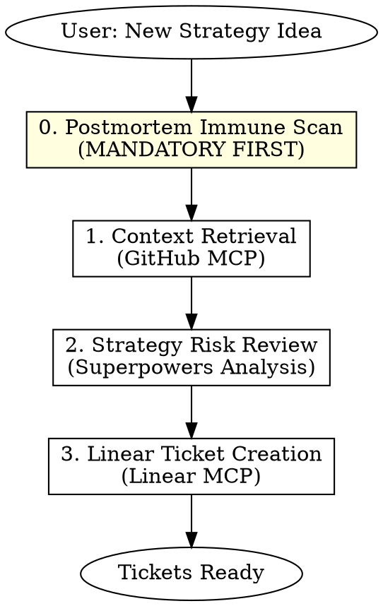
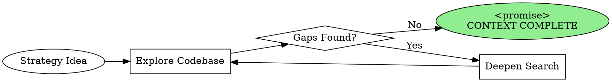

# Blueprint Plan - Strategy Architecture & Task Decomposition

## Overview

Transform vague strategy ideas into executable Linear Tickets with proper risk assessment, backtest specifications, and **Postmortem immune screening** to prevent regression.

## Core Principle

```
./postmortem/ = 深度病历库 (Deep Case History)
./CLAUDE.md   = 高频手术准则 (High-Frequency Operating Rules)

Rule: 新策略必须通过历史病历的"免疫筛查"
```

## When to Use

- User wants to plan a **new trading strategy** for Polymarket
- User mentions "策略规划", "strategy planning", or "feature decomposition"
- Before any implementation of market-making or trading logic

**Do NOT use when:**
- Debugging existing strategy code
- Running backtests (use execution skills instead)
- Simple code changes unrelated to strategy

## Workflow



## Phase 0: Postmortem Immune Scan (MANDATORY)

**Goal:** Screen new strategy against historical failures to prevent regression.

### Step 0.1: Scan Postmortem Directory

```bash
# List all postmortem files
ls -la ./postmortem/

# Read each relevant postmortem
cat ./postmortem/*.md
```

### Step 0.2: Keyword Matching

Search postmortems for terms related to the new strategy:

| Strategy Type | Keywords to Scan |
|---------------|------------------|
| **Market Making** | spread, inventory, quote, bid, ask, fill |
| **Mean Reversion** | revert, mean, deviation, zscore, band |
| **Momentum** | trend, breakout, signal, momentum |
| **Arbitrage** | arb, spread, cross-market, latency |
| **Any Strategy** | API, rate limit, timeout, websocket, order |

```
Tool: Grep
Pattern: [relevant keywords]
Path: ./postmortem/
```

### Step 0.3: Immune Report Generation

For each relevant postmortem found, extract:

```markdown
## 🛡️ Immune Screening Report

### Relevant Historical Incidents

| PM File | Incident | Root Cause | Relevance to New Strategy |
|---------|----------|------------|---------------------------|
| PM-001.md | Order duplication | Missing idempotency | HIGH - uses same order API |
| PM-003.md | Liquidity trap | No exit strategy | MEDIUM - similar market type |

### Mandatory Mitigations (from Postmortems)

- [ ] [Mitigation 1 from PM-001]
- [ ] [Mitigation 2 from PM-003]

### Cleared (No Relevant History)

- [List of scanned categories with no matches]
```

**BLOCKING:** If HIGH relevance incidents found, mitigations MUST be included in ticket acceptance criteria.

**Output:** Immune Screening Report appended to ticket.

### 🔄 Ralph Loop: Thorough Context Gathering (Optional)

**When to Activate:** Complex strategies requiring deep codebase understanding.

For strategies touching multiple existing systems, use Ralph Loop to iteratively build comprehensive context:

```
Skill: ralph-loop:ralph-loop

Prompt Template:
"Gather comprehensive context for [strategy_name].

Target areas:
- Existing strategies in strategies/
- Backtest framework in backtest/
- API integrations in api/
- PM files in postmortem/

Build context map:
- [ ] All relevant files identified
- [ ] Interface contracts documented
- [ ] PM risks catalogued
- [ ] Dependencies mapped

Output <promise>CONTEXT COMPLETE</promise> when context map is comprehensive."

Options:
--max-iterations 8
--completion-promise "CONTEXT COMPLETE"
```

### Ralph Loop Context Gathering Cycle



### Context Completeness Checklist

| Area | Questions to Answer |
|------|---------------------|
| **Strategies** | What patterns exist? What interfaces are required? |
| **Backtest** | What data format? What metrics calculated? |
| **API** | What rate limits? What auth method? |
| **Postmortems** | What risks relate to this strategy type? |
| **Dependencies** | What versions? What conflicts possible? |

### When to Use Ralph Loop for Planning

| Situation | Use Ralph Loop? |
|-----------|----------------|
| New strategy type (no similar exists) | ✅ Yes - need thorough exploration |
| Many existing strategies to learn from | ✅ Yes - comprehensive pattern mining |
| Simple variant of existing strategy | ❌ No - direct PM scan sufficient |
| User provided detailed specs | ❌ No - context already clear |

## Phase 1: Context Retrieval

**Required:** Confirm project structure before proceeding.

Use GitHub MCP to inspect:
- `backtest/` directory: Existing backtest framework, data sources, metrics
- `strategies/` directory: Current strategy implementations, common patterns

```
Action: Use mcp__github__get_file_contents to list directories
If directories don't exist: Note this as "greenfield implementation"
```

**Output:** Summary of existing codebase context or "greenfield" status.

## Phase 2: Strategy Risk Review

Analyze the proposed strategy for Polymarket-specific risks:

| Risk Category | Check Items |
|---------------|-------------|
| **Inventory Risk** | Position limits, hedging approach, exposure caps |
| **Slippage** | Order book depth, spread compensation, market impact |
| **Liquidity** | Market depth assumptions, exit strategy |
| **Model Risk** | Probability estimation method, edge decay |
| **PM-Flagged Risks** | All HIGH/MEDIUM items from Phase 0 |

**Output:** Risk assessment summary with mitigation recommendations.

## Phase 3: Linear Ticket Creation

### Main Ticket Structure

Create a **Feature/Strategy** ticket with:

```markdown
## Strategy: [Strategy Name]

### Description
[Brief strategy overview]

### 🛡️ Postmortem Immune Screening
[Summary from Phase 0 - REQUIRED SECTION]

**Relevant Incidents:** [count]
**Mandatory Mitigations:** [list]

### Risk Assessment
[Summary from Phase 2]

### Backtest Baseline Metrics
| Metric | Target | Minimum Acceptable |
|--------|--------|-------------------|
| Sharpe Ratio | ≥ 2.0 | ≥ 1.5 |
| Max Drawdown (MDD) | ≤ 10% | ≤ 15% |
| APR | ≥ 30% | ≥ 20% |

### Acceptance Criteria
- [ ] Strategy passes backtest with baseline metrics
- [ ] Risk limits implemented
- [ ] Paper trading validation complete
- [ ] **PM mitigations verified:** [list each]
```

### Required Sub-tickets

Auto-create two child tickets:

1. **策略实现 (Strategy Implementation)**
   - Core trading logic
   - Order placement/cancellation
   - Position management
   - **PM mitigation implementations**

2. **回测用例编写 (Backtest Case Development)**
   - Historical data integration
   - Performance metrics calculation
   - Edge case scenarios
   - **PM regression test cases**

Use `mcp__plugin_linear_linear__create_issue` with `parentId` for sub-tickets.

## Quick Reference

| Phase | Tool | Key Action |
|-------|------|------------|
| 0. PM Scan | `Grep` + `Read` | Scan `postmortem/` for relevant incidents |
| 0b. 🔄 Ralph | `ralph-loop:ralph-loop` | Thorough context gathering (optional) |
| 1. Context | `mcp__github__get_file_contents` | List `backtest/`, `strategies/` |
| 2. Review | Analysis (no tool) | Risk matrix + PM-flagged risks |
| 3. Linear | `mcp__plugin_linear_linear__create_issue` | Create tickets with PM section |

## Common Mistakes

| Mistake | Fix |
|---------|-----|
| **Skipping PM scan** | Phase 0 is MANDATORY, not optional |
| Ignoring HIGH relevance incidents | MUST include mitigations in acceptance criteria |
| Skipping context check | Always verify codebase structure first |
| Missing metrics baseline | Include Sharpe, MDD, APR targets in every ticket |
| No sub-ticket linking | Use `parentId` to properly link sub-tasks |
| Vague risk assessment | Be specific: "10% position cap" not "manage inventory" |

## Postmortem File Format Reference

Expected structure in `./postmortem/`:

```
postmortem/
├── PM-001-order-duplication.md
├── PM-002-api-timeout-cascade.md
├── PM-003-liquidity-trap.md
└── TEMPLATE.md
```

Each PM file should contain:
- **Incident Date**
- **Root Cause**
- **Impact**
- **Mitigations Implemented**
- **Keywords** (for searchability)

## Example Invocation

### Standard Mode
```
User: "Plan a mean-reversion strategy for Polymarket presidential election markets"

Claude:
0. [PM Scan] Scanning postmortem/ for: revert, mean, election, spread...
   Found: PM-003 (liquidity trap in election markets) - HIGH relevance
   Mitigation required: Exit strategy for illiquid periods

1. [Context] Checking backtest/ and strategies/ via GitHub...
   Found existing mean-reversion base class

2. [Review] Risk assessment for mean-reversion in binary markets...
   Added PM-003 mitigation to risk matrix

3. [Linear] Creating main ticket + 2 sub-tickets...
   - Main ticket includes PM Immune Screening section
   - Acceptance criteria includes PM-003 mitigation verification

Output: Links to created Linear tickets with PM screening embedded
```

### 🔄 Ralph Loop Mode (Deep Context Gathering)
```
User: "Plan a cross-market arbitrage strategy，这是我们第一次做套利"

Claude:
0. [PM Scan] Scanning postmortem/ for: arb, spread, cross-market, latency...
   Found: Multiple potential risks
   First arbitrage strategy → Need thorough context

🔄 [Ralph Loop: Context Gathering]
   Invoking: /ralph-loop "Gather comprehensive context for cross-market arbitrage.
   Areas: strategies/, backtest/, api/, postmortem/
   First arb strategy - need complete understanding.
   Output <promise>CONTEXT COMPLETE</promise> when map is comprehensive."
   --max-iterations 8
   --completion-promise "CONTEXT COMPLETE"

   Iteration 1: Explored strategies/ → Found market-making base, no arb
   Iteration 2: Explored backtest/ → Multi-market data format identified
   Iteration 3: Explored api/ → Rate limits per exchange documented
   Iteration 4: Deep PM scan → 3 latency-related incidents found
   Iteration 5: Dependencies → Websocket libraries identified

   <promise>CONTEXT COMPLETE</promise>

🔄 [Ralph Loop Complete]
   Context Map Built:
   - Existing patterns: Market-making (adaptable)
   - Backtest: Supports multi-market (need sync logic)
   - API: 3 exchange connectors, different rate limits
   - PM Risks: Latency (PM-004), Data sync (PM-006), Order timing (PM-009)
   - Dependencies: asyncio, websockets (no conflicts)

1-3. [Proceeding with Context, Review, Linear...]
   Tickets created with comprehensive PM risks from deep scan

Output: Well-informed tickets based on thorough codebase exploration
```
