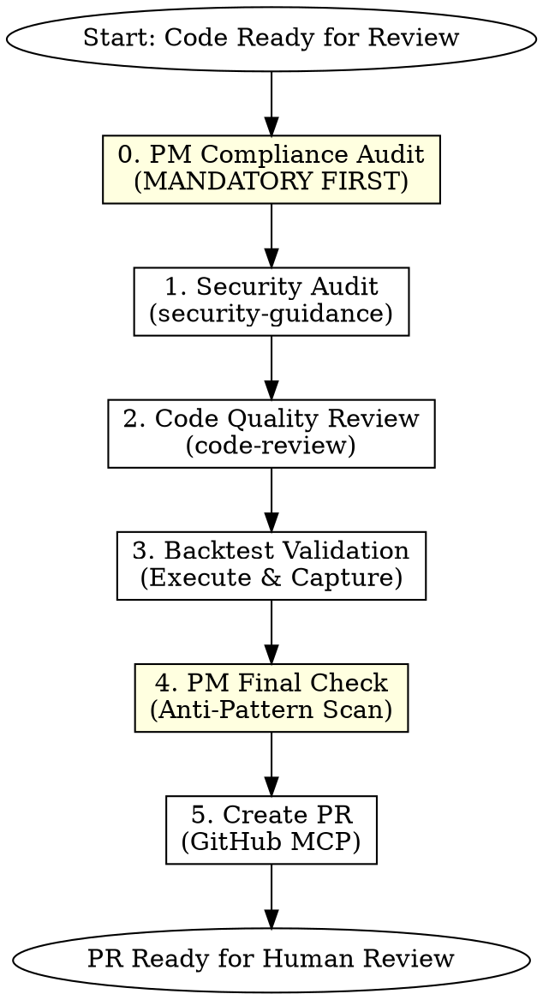
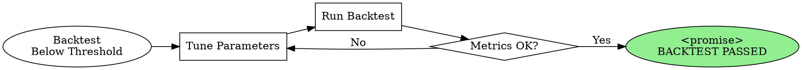

# Blueprint Review - Security, Quality & PM Compliance Assessment

## Overview

Multi-dimensional code review ensuring **Postmortem compliance**, security compliance, error handling robustness, and validated backtest results before PR creation.

## Core Principle

```
./postmortem/ = 深度病历库 (Deep Case History)
./CLAUDE.md   = 高频手术准则 (High-Frequency Operating Rules)

Rule: PR 不能引入任何已记录在案的反模式，必须通过"病历复查"
```

## When to Use

- Strategy implementation is complete (after `blueprint-develop`)
- Ready to create PR for merge
- User mentions "review", "审核", "PR ready", or "quality check"
- Before any strategy code goes to production

**Do NOT use when:**
- Still implementing features (use `blueprint-develop`)
- Planning phase (use `blueprint-plan`)
- Backtest-only runs without code review intent

## Prerequisites

Before invoking this skill, verify:
- [ ] All tests passing (from `blueprint-develop` Phase 5)
- [ ] **PM regression tests passing** (from `blueprint-develop` Phase 2)
- [ ] Code committed to feature branch
- [ ] Linear ticket linked to the work

## Workflow



## Phase 0: PM Compliance Audit (MANDATORY)

**Goal:** Verify implementation doesn't repeat any documented failures.

### Step 0.0: Gather Context (if needed)

When analyzing complex PM compliance issues:

```
Use Skill tool: context7:context7
Purpose: Gather comprehensive context about PM mitigations and related code
Focus: PM-related code patterns, historical fixes, compliance requirements
```

### Step 0.1: Run PM Regression Tests

```bash
# MUST pass before proceeding
pytest tests/pm_regression/ -v --tb=short

# If any fail, STOP and return to blueprint-develop
```

### Step 0.2: Cross-Reference PM Mitigations

From the Linear ticket, verify each PM mitigation is implemented:

```markdown
## PM Compliance Verification

| PM | Required Mitigation | Implemented? | Evidence |
|----|---------------------|--------------|----------|
| PM-001 | Idempotency key on orders | ✅ | execution.py:45 |
| PM-003 | Liquidity check before entry | ✅ | signals.py:23 |
| PM-003 | Exit timeout mechanism | ✅ | execution.py:89 |
```

### Step 0.3: CLAUDE.md Directive Check

```bash
# Read current directives
cat ./CLAUDE.md
```

Verify code adheres to ALL directives:

```markdown
## CLAUDE.md Compliance

| Directive | Compliant? | Evidence |
|-----------|------------|----------|
| Use decimal.Decimal for prices | ✅ | grep -r "Decimal" strategies/ |
| Rate limit: 1.2s min delay | ✅ | api/client.py:34 |
| Log order IDs immediately | ✅ | execution.py:47 |
```

**BLOCKING:** If ANY PM mitigation is missing or CLAUDE.md directive violated, STOP and return to `blueprint-develop`.

**Output:** PM Compliance Report.

## Phase 1: Security Audit

**Goal:** Ensure no security vulnerabilities in trading bot code.

### Step 1.1: Invoke Security Guidance

```
Use Skill tool: security-guidance:security-guidance
Purpose: Get security best practices and vulnerability guidance
Focus: Trading bot security, API key handling, credential management
```

### Step 1.2: Security Checklist

| Category | Check Items | Severity |
|----------|-------------|----------|
| **Private Key Handling** | No hardcoded keys, env vars only, no logging of secrets | CRITICAL |
| **API Credentials** | Secure storage, rotation support, no plaintext | CRITICAL |
| **Rate Limiting** | Backoff logic, rate limit headers respected | HIGH |
| **Input Validation** | All external data sanitized | HIGH |
| **Error Messages** | No sensitive data in logs/errors | MEDIUM |

### Security Scan Actions

```
1. Grep for security anti-patterns:
   - "private_key\s*=" (hardcoded keys)
   - "api_key\s*=" (hardcoded credentials)
   - "password\s*=" (plaintext passwords)
   - "print.*key|secret|password" (secret logging)

2. Verify secure patterns:
   - os.environ.get() or dotenv usage
   - try/except around API calls with rate limit handling
   - No credentials in git history
```

### PM-Informed Security Patterns

Check for security issues documented in postmortems:

```bash
# Search postmortems for security-related incidents
grep -l "security\|credential\|key\|leak" ./postmortem/*.md
```

**Output:** Security audit report with PASS/FAIL per category.

## Phase 2: Code Quality Review

**Goal:** Ensure robust error handling for market-making bot reliability.

### Step 2.1: Invoke Superpowers Code Review

```
Use Skill tool: superpowers:requesting-code-review
Focus areas:
- Exception handling completeness
- Network resilience
- State recovery after failures
- PM anti-pattern avoidance
```

### Step 2.2: Invoke Code Review Skill (Complementary)

```
Use Skill tool: code-review:code-review
Purpose: Additional code review perspective, especially for PR-specific concerns
Focus: PR readiness, merge conflicts, branch hygiene
```

### Critical Error Handling Patterns

| Scenario | Required Handling | Anti-pattern |
|----------|------------------|--------------|
| **Network Timeout** | Retry with exponential backoff | Single try, crash on fail |
| **API Error 5xx** | Log, wait, retry (max 3) | Immediate retry flood |
| **WebSocket Disconnect** | Auto-reconnect with state sync | Manual restart required |
| **Order Rejection** | Log reason, adjust, retry | Silent failure |
| **Data Feed Gap** | Detect, flag, use stale indicator | Trade on stale data |

### PM-Specific Anti-Pattern Scan

```bash
# For each PM, grep for the documented anti-pattern
# Example from PM-002:
grep -rn "time.sleep(0)" strategies/  # Should find nothing

# Example from PM-004:
grep -rn "while True:" strategies/  # Check for unbounded loops
```

### Bot Resilience Checklist

- [ ] All API calls wrapped in try/except
- [ ] Retry logic with backoff for transient errors
- [ ] WebSocket auto-reconnect implemented
- [ ] Graceful shutdown on SIGTERM/SIGINT
- [ ] State persistence for recovery after restart
- [ ] Health check endpoint or heartbeat logging

**Output:** Code review report with findings and required fixes.

## Phase 3: Backtest Validation

**Goal:** Execute backtest and capture results for PR documentation.

### CRITICAL: Claude Code MUST Execute Backtest

Do not skip this phase. Run the actual backtest script.

```bash
# Standard backtest execution
python -m backtest.run --strategy [strategy_name] --output results/

# Or project-specific command (check backtest/README.md)
```

### Capture Required Outputs

| Output Type | Location | PR Inclusion |
|-------------|----------|--------------|
| **Performance Metrics** | Terminal stdout | Copy to PR body |
| **Equity Curve Chart** | `results/*.png` | Reference path in PR |
| **Trade Log** | `results/trades.csv` | Summarize stats |
| **Risk Metrics** | Terminal or JSON | Include in table |

### Metrics Summary Template

```markdown
## Backtest Results

**Period:** [start_date] to [end_date]
**Markets:** [list of markets tested]

### Performance Metrics
| Metric | Value | Target | Status |
|--------|-------|--------|--------|
| Sharpe Ratio | X.XX | ≥ 2.0 | ✅/❌ |
| Max Drawdown | X.X% | ≤ 10% | ✅/❌ |
| APR | XX.X% | ≥ 30% | ✅/❌ |
| Win Rate | XX.X% | ≥ 55% | ✅/❌ |
| Total Trades | XXX | - | - |

### Charts
- Equity Curve: `results/equity_curve.png`
- Drawdown Chart: `results/drawdown.png`

### Notes
[Any observations, edge cases, or caveats]
```

### Backtest Failure Handling

If backtest fails or metrics below threshold:
1. **DO NOT proceed to PR creation**
2. Document failure reason
3. **Check if failure relates to a PM** (potential new PM candidate)
4. Return to `blueprint-develop` for fixes
5. Re-run this skill after fixes

**Output:** Backtest results summary formatted for PR.

### 🔄 Ralph Loop: Iterative Backtest Optimization (Optional)

**When to Activate:** Backtest metrics close to threshold but not passing.

Instead of returning to `blueprint-develop`, use Ralph Loop for iterative parameter tuning:

```
Skill: ralph-loop:ralph-loop

Prompt Template:
"Optimize [strategy_name] backtest parameters.
Current metrics:
- Sharpe: X.XX (target: ≥ 2.0)
- MDD: X.X% (target: ≤ 10%)
- APR: XX% (target: ≥ 30%)

Constraints:
- PM compliance must be maintained
- Only tune: [allowed_parameters]
- DO NOT modify core logic

Output <promise>BACKTEST PASSED</promise> when ALL metrics meet targets."

Options:
--max-iterations 10
--completion-promise "BACKTEST PASSED"
```

### Ralph Loop Backtest Cycle



### Ralph Loop Constraints for Backtest

| Allowed | NOT Allowed |
|---------|-------------|
| Risk parameters (stop loss %, position size) | Core signal logic |
| Entry/exit thresholds | PM mitigation removal |
| Spread compensation factors | Test modifications |
| Timing parameters | Changing target metrics |

### When to Use Ralph Loop vs Return to Develop

| Situation | Action |
|-----------|--------|
| Sharpe 1.8, need 2.0 | 🔄 Ralph Loop - tune params |
| Sharpe 0.5, need 2.0 | ❌ Return to develop - fundamental issue |
| MDD 12%, need 10% | 🔄 Ralph Loop - adjust risk params |
| Tests failing | ❌ Return to develop - not a tuning issue |
| PM compliance issue | ❌ Return to develop - NEVER tune away compliance |

## Phase 4: PM Final Check (Anti-Pattern Scan)

**Goal:** Final sweep for any PM-documented anti-patterns that may have slipped through.

### Comprehensive Anti-Pattern Grep

```bash
# Load all anti-patterns from postmortems
for pm in ./postmortem/PM-*.md; do
    echo "=== Checking patterns from $pm ==="
    # Extract "DON'T" patterns and grep for them
done
```

### Anti-Pattern Checklist from All PMs

Generate a comprehensive checklist:

```markdown
## Final Anti-Pattern Sweep

### From PM Files
| PM | Anti-Pattern | Found? | Action |
|----|--------------|--------|--------|
| PM-001 | Missing client_order_id | ❌ None | OK |
| PM-002 | Hardcoded API delay | ❌ None | OK |
| PM-003 | No liquidity check | ❌ None | OK |
| PM-004 | Unbounded retry loop | ❌ None | OK |

### From CLAUDE.md
| Directive Violation | Found? | Action |
|--------------------|--------|--------|
| Float for price calc | ❌ None | OK |
| Missing order log | ❌ None | OK |
```

**BLOCKING:** If ANY anti-pattern found, STOP and fix before PR.

**Output:** Clean anti-pattern scan report.

## Phase 5: PR Creation

**Goal:** Create PR with comprehensive PM compliance documentation.

### Step 5.1: Final Verification Before PR

```
Use Skill tool: superpowers:verification-before-completion
Purpose: Final check that all review phases completed successfully
Verify:
- PM compliance audit passed
- Security audit passed
- Code review passed
- Backtest metrics meet baseline
- Anti-pattern scan clean
```

### Step 5.2: Commit and Push (if needed)

If there are uncommitted changes:

```
Use Skill tool: commit-commands:commit
Purpose: Create standardized commit before PR
```

### Step 5.3: Create PR

**Option A: Use commit-push-pr (Recommended if uncommitted changes)**

```
Use Skill tool: commit-commands:commit-push-pr
Purpose: Commit, push, and create PR in one step
```

**Option B: Use GitHub MCP (if already committed)**

```
Tool: mcp__github__create_pull_request

Parameters:
- owner: [repo owner]
- repo: [repo name]
- title: "[Strategy] [Brief Description] - LIN-XXX"
- head: [feature-branch]
- base: main
- body: [Formatted PR body below]
```

### PR Body Template (PM-Enhanced)

```markdown
## Summary
[1-2 sentence description of the strategy/change]

**Linear Ticket:** [LIN-XXX](link)

## 🛡️ PM Compliance Report

### Postmortem Mitigations Verified
| PM | Mitigation | Status | Test |
|----|------------|--------|------|
| PM-001 | Idempotency key | ✅ | test_pm_001.py |
| PM-003 | Liquidity check | ✅ | test_pm_003.py |
| PM-003 | Exit timeout | ✅ | test_pm_003.py |

### CLAUDE.md Directives
| Directive | Status |
|-----------|--------|
| Decimal for prices | ✅ |
| Rate limit 1.2s | ✅ |
| Log order IDs | ✅ |

### Anti-Pattern Scan
- [x] No PM-documented anti-patterns found
- [x] All regression tests passing

## Security Review
| Check | Status |
|-------|--------|
| Private Key Handling | ✅ Passed |
| API Credentials | ✅ Passed |
| Rate Limiting | ✅ Passed |
| Input Validation | ✅ Passed |

## Code Quality Review
| Check | Status |
|-------|--------|
| Exception Handling | ✅ Passed |
| Network Resilience | ✅ Passed |
| State Recovery | ✅ Passed |

## Backtest Results

**Period:** [dates]

| Metric | Value | Target | Status |
|--------|-------|--------|--------|
| Sharpe Ratio | X.XX | ≥ 2.0 | ✅ |
| Max Drawdown | X.X% | ≤ 10% | ✅ |
| APR | XX.X% | ≥ 30% | ✅ |

<details>
<summary>Full Backtest Output</summary>

```
[Paste terminal output here]
```

</details>

## Test Coverage
- Unit Tests: XX passing
- **PM Regression Tests: XX passing**
- Coverage: XX%

## Checklist
- [ ] **PM compliance audit passed**
- [ ] Security audit passed
- [ ] Code review passed
- [ ] Backtest meets baseline metrics
- [ ] **Anti-pattern scan clean**
- [ ] Tests passing
- [ ] Ready for human review

---
🤖 Generated with Claude Code | PM Compliant ✅
```

### Post-PR Actions

After PR creation:
1. Add reviewers if known
2. Link PR to Linear ticket using `mcp__plugin_linear_linear__update_issue`
3. Add PR link as attachment to Linear ticket

**Output:** PR URL and confirmation of Linear ticket update.

## Quick Reference

| Phase | Tool/Skill | Key Action |
|-------|-----------|------------|
| 0. PM Audit | `context7:context7` (if needed) + `pytest tests/pm_regression/` | Gather context + Verify PM mitigations |
| 1. Security | `security-guidance:security-guidance` + `Grep` + security patterns | Security guidance + Scan for secrets |
| 2. Quality | `superpowers:requesting-code-review` + `code-review:code-review` | Exception handling + PR review |
| 3. Backtest | `Bash` (execute script) | Run backtest |
| 3b. 🔄 Ralph | `ralph-loop:ralph-loop` | Iterative param tuning (optional) |
| 4. PM Final | `context7:context7` (if needed) + `Grep` + PM anti-patterns | Gather context + Final sweep |
| 5. Verify | `superpowers:verification-before-completion` | Final check before PR |
| 5. PR | `commit-commands:commit-push-pr` or `mcp__github__create_pull_request` | Create with PM report |

## Common Mistakes

| Mistake | Prevention |
|---------|------------|
| **Skipping PM audit** | Phase 0 is MANDATORY, blocking gate |
| **No PM section in PR** | Always include PM Compliance Report |
| Skipping backtest execution | MUST run actual script |
| Generic security scan | Use trading-bot-specific patterns |
| PR without metrics | Always include Sharpe, MDD, APR |
| Missing Linear link | Update ticket with PR reference |
| **Ignoring anti-pattern scan** | Phase 4 must pass before PR |

## Exit Criteria

Before marking review complete:

- [ ] **PM Compliance Audit: All mitigations verified**
- [ ] **PM Regression Tests: All passing**
- [ ] **Anti-Pattern Scan: Clean**
- [ ] Security audit: All categories PASSED
- [ ] Code review: No blocking issues
- [ ] Backtest: All metrics meet or exceed baseline
- [ ] PR created with PM Compliance Report
- [ ] Linear ticket updated with PR link

## Example Invocation

### Standard Mode
```
User: "Review the mean-reversion strategy and create PR"

Claude:
0. [PM Audit] Running PM regression tests...
   pytest tests/pm_regression/ → 6/6 passed ✅
   PM-001 mitigation: verified in execution.py:45 ✅
   PM-003 mitigations: verified in signals.py:23, execution.py:89 ✅
   CLAUDE.md directives: 5/5 compliant ✅

1. [Security] Scanning for secrets... No hardcoded keys found ✅
   Rate limit handling verified in api/client.py ✅

2. [Quality] Running code-review skill...
   Exception handling: 12/12 API calls wrapped ✅
   Network resilience: Auto-reconnect implemented ✅

3. [Backtest] Executing: python -m backtest.run --strategy mean_reversion
   Sharpe: 2.3 ✅ | MDD: 8.2% ✅ | APR: 34% ✅

4. [PM Final] Anti-pattern scan...
   Scanned for 12 anti-patterns from 4 PMs → None found ✅

5. [PR] Created: https://github.com/org/repo/pull/42
   Includes PM Compliance Report ✅
   Linear ticket LIN-123 updated with PR link

Output: PR #42 ready for human review (PM Compliant)
```

### 🔄 Ralph Loop Mode (Backtest Optimization)
```
User: "Review strategy, backtest 还差一点点达标"

Claude:
0-2. [Standard Phases Complete] ✅

3. [Backtest] First run results:
   Sharpe: 1.85 ❌ (target: ≥ 2.0)
   MDD: 9.5% ✅
   APR: 28% ❌ (target: ≥ 30%)

   Metrics close to threshold → Activating Ralph Loop

🔄 [Ralph Loop: Backtest Optimization]
   Invoking: /ralph-loop "Optimize mean-reversion parameters.
   Current: Sharpe 1.85, APR 28%
   Target: Sharpe ≥ 2.0, APR ≥ 30%
   Allowed params: spread_threshold, position_size_pct, exit_timeout_hours
   PM compliance must be maintained.
   Output <promise>BACKTEST PASSED</promise> when targets met."
   --max-iterations 8
   --completion-promise "BACKTEST PASSED"

   Iteration 1: Sharpe 1.85 → 1.92 (adjusted spread_threshold)
   Iteration 2: Sharpe 1.92 → 1.98 (tuned position_size_pct)
   Iteration 3: Sharpe 1.98 → 2.05, APR 31% ✅

   <promise>BACKTEST PASSED</promise>

🔄 [Ralph Loop Complete]
   Final metrics: Sharpe 2.05 ✅ | MDD 9.8% ✅ | APR 31% ✅
   PM Compliance: Maintained ✅

4-5. [Continuing to PM Final Check and PR...]

Output: PR created with optimized parameters via Ralph Loop
```
